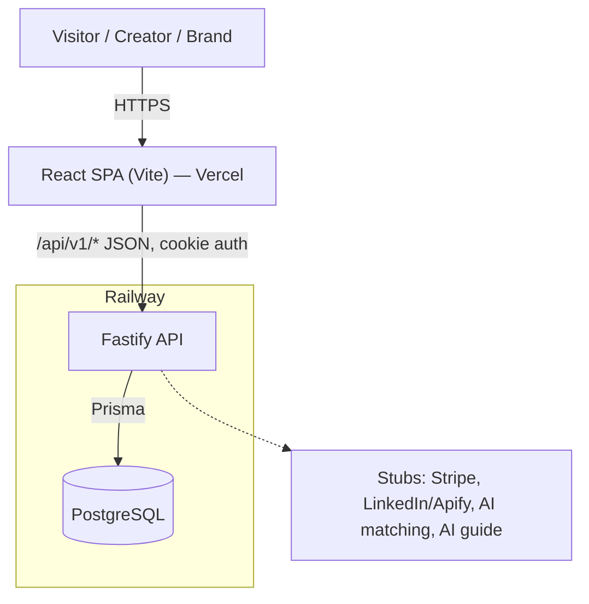
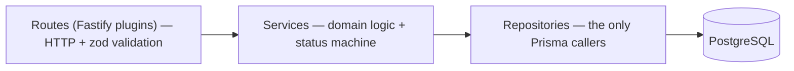
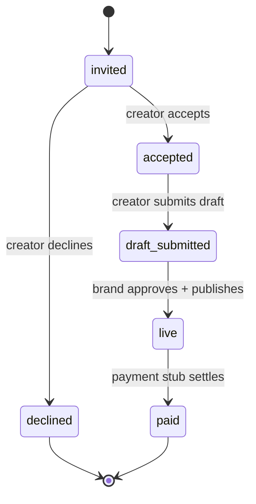

# 00 — Master spec (contract)

This is the shared contract for the Naano rebuild. Every step spec (`01`…`10`) inherits the rules here and must not contradict them. Feature detail belongs in the step specs; this file holds only cross-cutting decisions.

Status: **LOCKED** for D001–D003, architecture, stack, and conventions. Changes require an explicit decision in chat.

---

## 1. Product one-liner

Naano is a two-sided B2B marketplace where brands book LinkedIn creators at a flat price per post. Creators publish a priced "card"; brands run campaigns and invite creators; each booking becomes a **collaboration** that moves from invite to paid.

## 2. What "near-clone" means for us (D003 = B)

We reproduce the original's **structure, layout, spacing, color, typography, and copy tone**, using the captured `recon/` screenshots and page dumps as the reference. We are **not** pixel-diffing and **not** reusing their code or assets. When a detail is unknown, we choose the closest plausible option and note it in the step spec.

## 3. Locked decisions

| ID | Choice | Meaning |
|---|---|---|
| D001 | A | Thin two-sided MVP — both `/creator` and `/brand` happy paths ship |
| D002 | B | Separate frontend, backend, and database |
| D003 | B | Visual near-clone of the official site, using `recon/` as reference |

## 4. Architecture

Single API boundary. Three thin backend layers. Cookie-session auth. `Collaboration` is the central join object.



Backend layering:



Binding rules:

- The React SPA never touches Postgres or the stubs directly. Everything crosses the one API boundary at `/api/v1/*`.
- Domain logic — including the collaboration status machine — lives in **services**, not routes. Only **repositories** import Prisma.
- Auth is an httpOnly cookie session. The frontend sends `credentials: include` and never handles tokens.
- Cross-site cookies between Vercel and Railway use `SameSite=None; Secure`.

## 5. Stack

| Layer | Choice |
|---|---|
| Frontend | React SPA (Vite) + TypeScript + Tailwind, API-only, no SSR |
| Backend | Fastify + TypeScript (routes → services → repositories) |
| Validation | zod at the route boundary |
| ORM / DB | Prisma + PostgreSQL |
| Auth | httpOnly cookie session |
| Hosting | Vercel (frontend), Railway (API + Postgres) |

## 6. Repo layout

```
frontend/            # React SPA (Vite)
  src/
    pages/           # route-level screens
    components/
    lib/api.ts       # single fetch wrapper, credentials: include
backend/
  src/
    routes/          # Fastify plugins, one per resource
    services/        # domain logic + status machine
    repositories/    # Prisma access
    lib/
  prisma/
    schema.prisma
    seed.ts
specs/               # these files
recon/               # reference screenshots + dumps (read-only)
.agent-logs/         # captured prompts/responses, committed with the repo
```

## 7. Glossary

- **Brand** — a company user (`role=brand`, original: `role=saas`) that runs campaigns and books creators.
- **Creator** — a LinkedIn creator user (`role=creator`, original: `role=influencer`) who sells posts.
- **Card** — the creator's public marketplace profile: niche, stats, and a flat price per post.
- **Campaign** — a brand's brief and budget that creators can be booked against.
- **Opportunity** — a campaign as seen from the creator side (browse / invited / applied).
- **Collaboration** — one creator booked on one campaign; the central object both apps revolve around.
- **Deliverable** — the post a creator submits inside a collaboration.

## 8. Canonical entities

Authoritative field lists live in the S02 data-model spec; this is the shape both apps assume.

- **User** — `id`, `email`, `role` (`creator` | `brand`), `passwordHash`, timestamps.
- **CreatorProfile** — `userId`, `name`, `headline`, `niche`, `followers`, `ratePerPostCents`, `cardPublished`.
- **BrandProfile** — `userId`, `company`, `website`.
- **Campaign** — `id`, `brandProfileId`, `title`, `brief`, `budgetCents`, `status` (`draft` | `active` | `completed`).
- **Collaboration** — `id`, `campaignId`, `creatorProfileId`, `status` (see §9), `agreedRateCents`.
- **Deliverable** — `id`, `collaborationId`, `draftUrl`, `status`.

## 9. Collaboration status machine

The spine both apps hang off. Owned by a service; no route mutates status directly.



- **invited** — brand invited the creator from the marketplace.
- **accepted** — creator accepted from opportunities.
- **declined** — terminal; creator passed.
- **draft_submitted** — creator submitted a draft deliverable.
- **live** — brand approved; the post is "published".
- **paid** — payment stub settled; terminal.

Transitions are the only allowed status changes. Any other transition is a `409`.

## 10. Conventions

- **API prefix**: all endpoints under `/api/v1/*`.
- **Error shape**: every error response is `{ "error": { "code": string, "message": string } }`.
- **Auth**: httpOnly cookie session; `GET /api/v1/me` returns the current user or `401`.
- **Money**: integer **euro cents** everywhere (`ratePerPostCents`, `budgetCents`). Never floats. Format to euros only in the UI.
- **IDs**: uuid strings.
- **Env vars**: `DATABASE_URL`, `SESSION_SECRET`, `CORS_ORIGIN` (backend); `VITE_API_URL` (frontend). S09 adds `OPENAI_API_KEY` (or equivalent) server-side only.
- **Roles**: internal values are `creator` and `brand`. Register accepts and maps the original `influencer`/`saas` query params where we mirror them.
- **Commits**: one commit per completed step, containing both the code and the `.agent-logs/` entries produced while building it. Never dump logs at the end. Never add `.agent-logs/` to `.gitignore`. Never edit or delete a log entry after the fact.

## 11. Global non-goals

Stubbed, not real, for the MVP: Stripe payouts, LinkedIn OAuth and Apify scraping, agency and talent-agency workspaces, MCP and Pixel Naano integrations, real-time messaging, and a genuine AI matching agent. Each appears as a convincing stub. The **S09 AI guide bar** is the one "AI" surface that makes a real LLM call (server-side), with a keyword fallback.

## 12. Step index

| ID | Title | Depends on | Exit criteria (one line) |
|---|---|---|---|
| S01 | Bootstrap | — | Frontend shell, API health route, and Postgres all run locally |
| S02 | Data model + seed | S01 | Schema migrates on an empty DB and seeds ~15 creators |
| S03 | Marketing near-clone | S01 | Logged-out home, creators, and pricing pages match the recon screenshots |
| S04 | First deploy | S03 | A stranger can open the live public URL |
| S05 | Auth + role fork | S02, S03 | Two accounts register and land in the correct app; wrong-role access is blocked |
| S06 | Creator app | S05 | Creator sets a rate, sees an invite, accepts, and sees the collaboration |
| S07 | Brand app | S06 | Brand creates a campaign, invites a creator, and tracks the collaboration |
| S08 | Stubs + polish | S07 | Full happy-path demo runs end to end with wallet, results, empty states, demo accounts |
| S09 | AI guide hover bar | S08 | Typed question hits the LLM endpoint and spawns an animated pointer to the matching element |
| S10 | Ship | S09 | Production smoke passes; repo public with `.agent-logs/` committed |

## 13. Step spec skeleton

Every step spec `NN-name.md` uses this structure, detailed enough that building requires no new product decisions:

1. Meta — id, status, depends-on, unlocks
2. Objective
3. User-visible outcome
4. In scope / out of scope
5. References — exact `recon/` paths used
6. Information architecture — routes, navigation, page inventory
7. UI spec — layout, colors, typography, components
8. API contracts — request/response shapes, status codes, auth requirements
9. Domain rules — validation, gates, status transitions
10. File touch list — expected paths under `frontend/` and `backend/`
11. Ordered implementation steps
12. Seed and fixtures (if any)
13. Acceptance tests — manual and automated
14. Exit criteria — checklist; the step is not done until all are checked

## 14. Definition of done (assignment)

- A stranger can open a **live public URL** and use both the creator and brand happy paths.
- The **repo is public** with `.agent-logs/` committed, interleaved with the code.
- The collaboration status machine works end to end: invite → accept → draft → live → paid.
- A short walkthrough (human-recorded, camera on) can show the full loop plus the marketing site and the AI guide bar.
